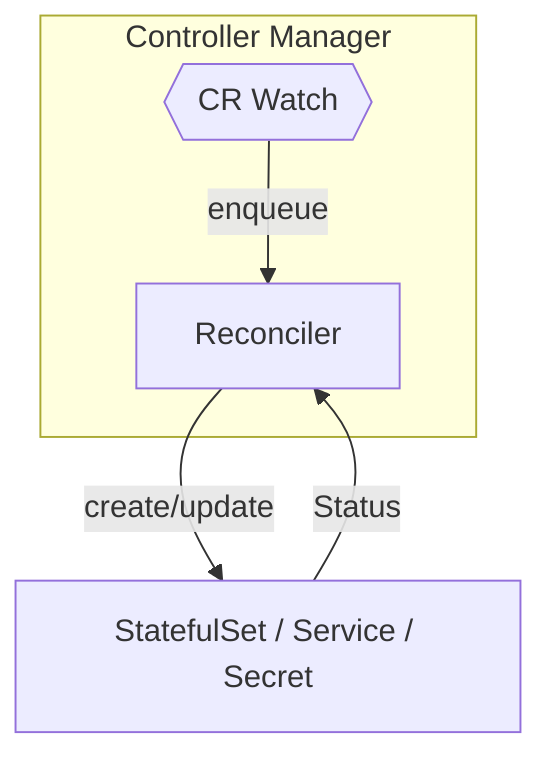
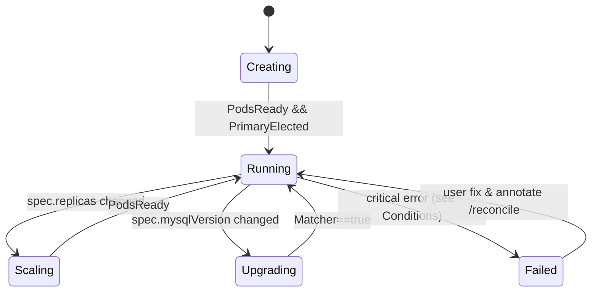
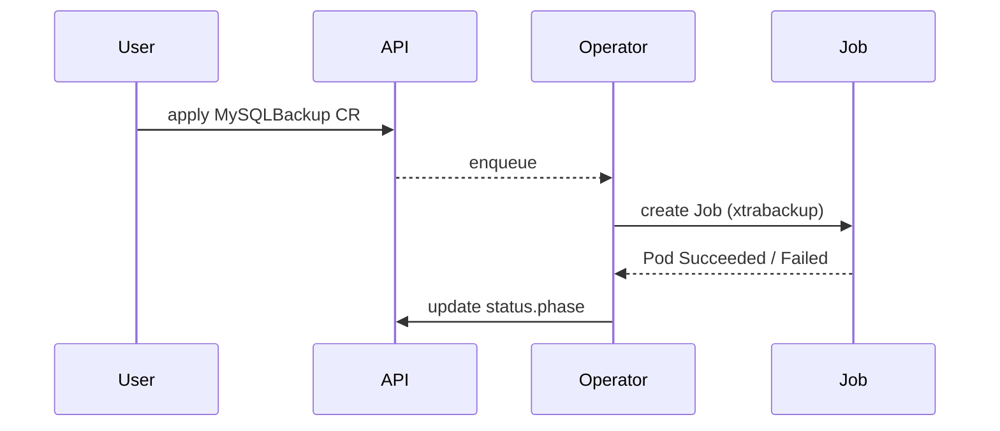

# 05‑controller‑logic

> **MySQL Operator – 控制器逻辑（Draft v0.1）**\
> 更新时间：2025‑07‑16

---

## 1. 架构概览



- **Controller Manager**：由 operator‑sdk 生成的 main 入口，注册两个 Reconciler：`MySQLClusterReconciler` 与 `MySQLBackupReconciler`。
- **Watcher**：监听 `mysqlclusters` / `mysqlbackups` 及其子资源（Pod、PVC、Job）。
- **Reconciler**：核心状态机，确保期望状态与集群状态一致。

---

## 2. Reconcile 主循环（MySQLCluster）

```text
1. Fetch MySQLCluster (MC)
2. Default & Validate  ➜ update if mutated
3. Ensure Root Secret  ➜ create if not exist / rotated
4. Reconcile StatefulSet
   • VolumeClaimTemplates (storageClassName, size)
   • InitContainer (xtrabackup prepare when restore)
   • Containers (mysql, exporter, sidecars)
5. Reconcile Services
   • ClusterIP for internal
   • NodePort write / read
6. Wait Pods Ready ➜ update .status.replicas / phase
7. Failover Logic (if Primary down)
8. Emit Events & Metrics
```

> **幂等原则**：每次循环仅依据 `spec` 与实际资源 diff，绝不做基于历史的推断，可多次重放。

### 2.1 代码片段（伪 Go）

```go
func (r *MySQLClusterReconciler) Reconcile(ctx context.Context, req ctrl.Request) (ctrl.Result, error) {
  mc := &v1alpha1.MySQLCluster{}
  if err := r.Get(ctx, req.NamespacedName, mc); err != nil { … }

  mutated := defaultAndValidate(mc)
  if mutated {
    if err := r.Update(ctx, mc); err != nil { return requeue(), err }
  }

  if err := r.ensureRootSecret(ctx, mc); err != nil { return retry(err) }

  if err := r.ensureStatefulSet(ctx, mc); err != nil { return retry(err) }
  if err := r.ensureServices(ctx, mc); err != nil { return retry(err) }

  if err := r.updateStatus(ctx, mc); err != nil { return retry(err) }

  return ctrl.Result{RequeueAfter: 30 * time.Second}, nil
}
```

---

## 3. 状态机 & Phase 转移



**Conditions**（写入 `.status.conditions[]`）：

| Type                 | Reason           | True 时含义            |
| -------------------- | ---------------- | ------------------- |
| `PrimaryHealthy`     | `HeartbeatOK`    | Primary MySQL 活跃且可写 |
| `FailoverInProgress` | `PromoteReplica` | 正在切主                |
| `BackupRunning`      | `JobCreated`     | 备份 Job 已启动          |

---

## 4. 主故障转移算法

1. **探测**：每 10 s 从 exporter 获取 `mysql_global_variables_read_only`；若 Primary Pod 不可达或 `read_only=1` 连续 3 次 → 触发。
2. **候选排序**：按 `Seconds_Behind_Master` 升序选择同步最前的 Replica。
3. **Promote**：在候选执行：
   ```sql
   STOP SLAVE; RESET SLAVE ALL; SET GLOBAL read_only=0;
   ```
4. **Service 更新**：Patch `mysql-write` Endpoint 指向新 Primary。
5. **原主降级**：重建时以 Replica 身份加入。

总耗时 ≈ Pod 探活(30‑40 s) + SQL Promote(1‑2 s) + Endpoint Patch(<1 s)。

---

## 5. Root 密码 Secret 逻辑

| 场景                                 | 行为                                                                                                          |
| ---------------------------------- | ----------------------------------------------------------------------------------------------------------- |
| `.spec.rootPassword` 为空            | Reconciler 第一次生成随机 16 位密码；写入 `Secret/<cluster>-root`；在 `.status.conditions` 标注 `RootPasswordGenerated=true` |
| `.spec.rootPassword` = 明文          | 若与 Secret 不同则更新 Secret；滚动重启 Pods 以注入新 env                                                                   |
| `.spec.rootPassword` 以 `ref://` 开头 | 按引用 Secret 注入；若引用不存在则设置 Phase=Failed                                                                        |

Secret 数据键：`password`；挂载路径 `/etc/mysql/secret`；容器 env：`MYSQL_ROOT_PASSWORD`= `$(ROOT_SECRET:password)`（由 projected volume 提供）。

---

## 6. 备份控制流（摘要）



失败时 Operator 按 (1 min, 2 min, 4 min) 指数退避重试，超过次数则 Phase=Failed。

---

## 7. 指标

| Metric                            | Type      | 说明            |
| --------------------------------- | --------- | ------------- |
| `mysqlcluster_phase_total{phase}` | Counter   | 每个 Phase 进入次数 |
| `mysqlcluster_failover_seconds`   | Histogram | 故障转移耗时        |
| `mysqlbackup_duration_seconds`    | Histogram | 备份作业耗时        |

导出路径：`/metrics`（自动被 Prometheus 抓取）。

---

## 8. 事件 (k8s Events)

| Reason            | Message 示例                                     |
| ----------------- | ---------------------------------------------- |
| `SecretGenerated` | "Generated new root password Secret/demo-root" |
| `FailoverSuccess` | "Replica demo-1 promoted to Primary"           |
| `BackupCompleted` | "Backup demo-full-20250716 finished in 3m12s"  |

---

## 9. 错误处理与重试

- **API 冲突**：使用 `client.IgnoreNotFound` + `RetryOnConflict`。
- **幂等变更**：所有 patch 使用 `controllerutil.CreateOrPatch`。
- **重队列**：返回 `ctrl.Result{RequeueAfter: N}`；若连续失败计数 `Status.RetryCount`。

---

## 10. 待办 / 优化

- [ ] 把 Failover 策略抽象为接口，便于后续支持 MGR / InnoDB Cluster。
- [ ] 实现 Pod `preStop` 钩子，在缩容或升级时优雅关闭连接。
- [ ] Backup Job 支持增量 + S3 直传，并增加失败自动清理。
- [ ] 将 rootPassword 从明文迁移到 SecretRef 默认模式，增强安全性。

---

> **评审提示**：请重点关注状态机转换、Secret 处理与 Failover 算法；通过后即可进入 UT / 集成测试开发阶段。

